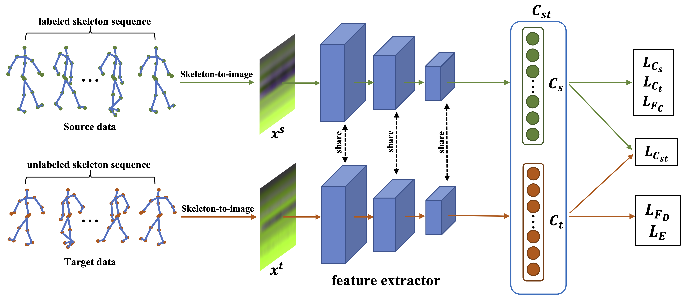
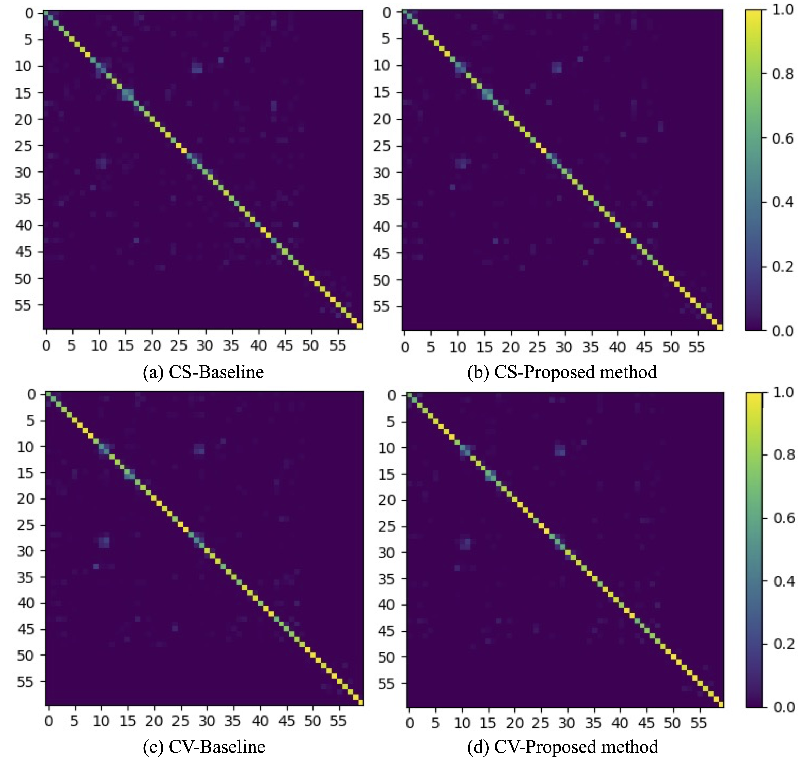

# Abstract

Due to the fast processing-speed and robustness it can achieve, skeleton-based action recognition has recently received the attention of the computer vision community. The recent Convolutional Neural Network (CNN)-based methods have shown commendable performance in learning spatio-temporal representations for skeleton sequence, which use skeleton image as input to a CNN. Since the CNNbased methods mainly encoding the temporal and skeleton joints simply as rows and columns, respectively, the latent correlation related to all joints may be lost caused by the 2D convolution. To solve this problem, we propose a novel CNN-based method with adversarial training for action recognition. We introduce a two-level domain adversarial learning to align the features of skeleton images from different view angles or subjects, respectively, thus further improve the generalization. We evaluated our proposed method on NTU RGB+D. It achieves competitive results compared with state-of-the-art methods and 2.4%, 1.9% accuracy gain than the baseline for cross-subject and crossview.

# Overview

<p align="center">
  
</p>
<p align="center">
  An illustration of our proposed method architecture. We define the two domain inputs as source and target, where the source represents the labeled skeleton sequence of one view (or subject). The target represents the unlabeled skeleton sequence of another view (or subject). Our network includes a feature extractor, source task classifier Cs, target task classifier Ct and a domain classifier Cst. Weights of all layers of feature extractor are shared for both source and target domain, and the Cst shares neurons with Cs and Ct. The green and orange colors illustrate the data flow of source and target, respectively. The right column shows a series of loss functions, please refer to our paper for the definition details.
</p>


In this paper, we proposed a novel action recognition network based on CNN and leverages unlabeled skeleton data from multiple views or subjects to learn view-invariant or subject-invariant feature representations of skeleton images. Our network learned the robust features for action recognition tasks by two-level domain adversarial learning strategy and entropy minimization. We trained our network on the NTU RGB+D dataset and demonstrated the effectiveness of our method on both cross-subject and cross-view setups. Experimental results showed that our proposed network outperforms baseline and state-of-the-art CNN-based methods. 


# COVID-19 CT Infection Segmentation Results
<p align="center">
  
</p>
<p align="center">
Qualitative results for two-class segmentation task. Columns 1 and 2 present the input real COVID-19 CT images and corresponding ground truth, while Column 6 is the segmentation result of our proposed method. The first to last rows are the results when taking ground-glass opacity (a), consolidation (b), infection (c) and the lung (d) as the segmentation object, respectively.
</p>

<p align="center">
  
</p>
<p align="center">
Qualitative results for multi-class segmentation task. Columns 1 and 2 show the input real COVID-19 CT images and corresponding ground truth, in which the ground-glass opacity is marked in blue, consolidation is marked in green, and the lung is marked in red. Columns 7 is the segmentation result for our proposed method.
</p>

# Acknowlegements
This work was supported by the Major Project of the Korea Institute of Civil Engineering and Building Technology(KICT) [grant number number 20210397-001].

# Citation
```
@article{chen2022unsupervised,
  title={Unsupervised domain adaptation based COVID-19 CT infection segmentation network},
  author={Chen, Han and Jiang, Yifan and Loew, Murray and Ko, Hanseok},
  journal={Applied Intelligence},
  volume={52},
  number={6},
  pages={6340--6353},
  year={2022},
  publisher={Springer}
}
```
